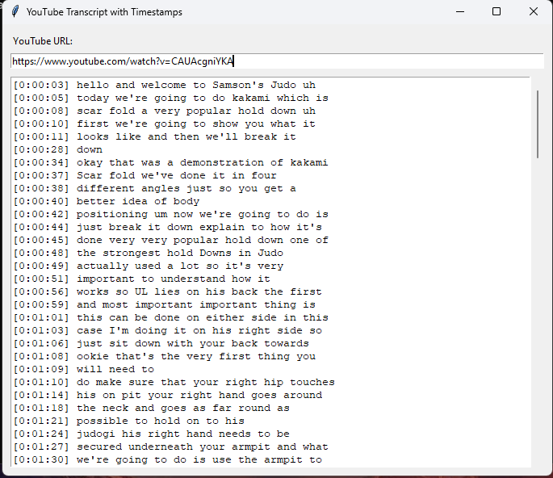

# YouTube Transcript Viewer with Timestamps

A simple Python GUI app to extract YouTube video transcripts and format them with timestamps.

---

## 📸 Screenshot

---

##  Installation on Windows using venv

1. **Clone the repository**
```
   git clone https://github.com/rubysash/yttranscript.git  
   cd youtube-transcript-viewer
```
2. **Create a virtual environment**  
```
   python -m venv yt-transcripts
```
3. **Activate the virtual environment**  
```
   venv\Scripts\activate
```
4. **Install dependencies**  
```
   pip install -r requirements.txt
```
---

## 🛠️ How it works

- Enter a **YouTube video URL** (standard or short format).
- The app **extracts the video ID**.
- It uses the **YouTube Transcript API** to fetch the transcript.
- Timestamps are **formatted** in HH:MM:SS style.
- The **transcript** with timestamps is displayed in the GUI.

---

## 🎯 Use Cases

- **Review videos** faster by reading the transcript.
- **Search for keywords** in transcripts.
- **Extract dialogue** for content repurposing.
- **Create summaries** of long videos.
- **Accessibility** for hearing-impaired users.
- **AI Input** text based for AI consumption

---

## ⚙️ Requirements

- Python 3.x
- tkinter (included with Python on Windows)
- youtube-transcript-api

---

## 📁 Usage

Run the app with:

python main.py

---
